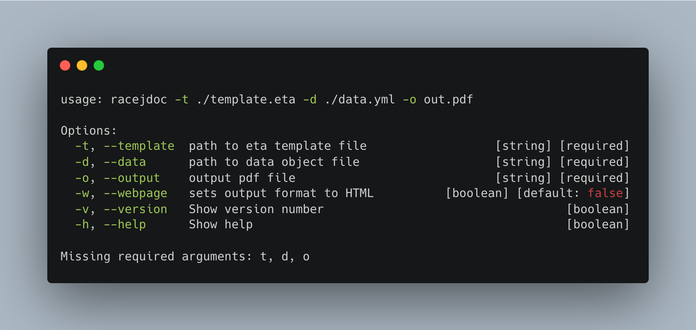

# racejdoc

A simple script to generate a pdf or an html page from a [eta](https://eta.js.org/) template and a json/yaml file with properties to render in it.

## Install

```shell
npm install -g racejdoc
```

## Usage

After the installation run **racejdoc** to get help on how to use the tool. 

If the installation went well the output should be something like this:



## Example with template and data in this repo

After the installation

```shell
racejdoc -t examples_templates/01.eta --data data_objects/01.json -o output/out.pdf
racejdoc -t examples_templates/01.eta --data data_objects/01.json -o output/out.html -w
```

this two commands will generate an html and a pdf version of the example into the [output](output/) folder

## Contribute

Fork, clone and in your local folder of racejdoc you can do two awesome step to develop with ease

```shell
npm i
npm link .
```

To install dependencies locally and add your editable version of `racejdoc` to your machine.

### Modify the linked script

To modify the script, edit the typescript file [cli.ts](cli.ts) and then run

```shell
npm run build
```

Or you can just **"hot-reload"** your personal `racejdoc` running the following command

```shell
npm run start:dev
```
