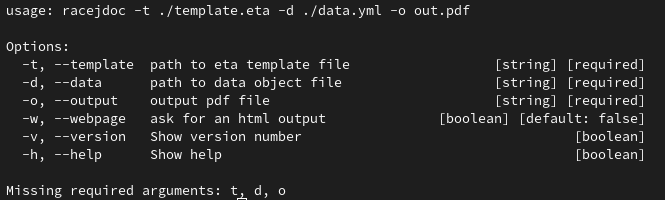

# racejdoc

A simple script to generate a pdf or an html page from a [eta](https://eta.js.org/) template and a json/yaml file with properties to render in it.

## Install

`npm install -g https://github.com/NessunoZero/racejdoc`

## Usage

After installation just run it in a terminal to get a guide about usage and options.

```shell
racejdoc
```

Should output something like this:



## Example with template and data in this repo

After installation

```shell
racejdoc -t examples_templates/01.eta --data data_objects/01.json -o output/out.pdf
racejdoc -t examples_templates/01.eta --data data_objects/01.json -o output/out.html -w
```

this two command will generate the html and pdf version of the example into the [output](output/) folder

## Contribute

Fork, clone and in your local folder of racejdoc you can do two awesome step to develop with ease

```shell
npm i
npm link .
```

To install dependencies locally and add your editable version to the binary of your computer

### Modify the linked script

And to modify the script itself, edit the typescript file [cli.ts](cli.ts) and then run

```shell
npm run build
```

Or you can just "hot-reload" your `racejdoc` linked version editing while is running the following command

```shell
npm run start:dev
```
